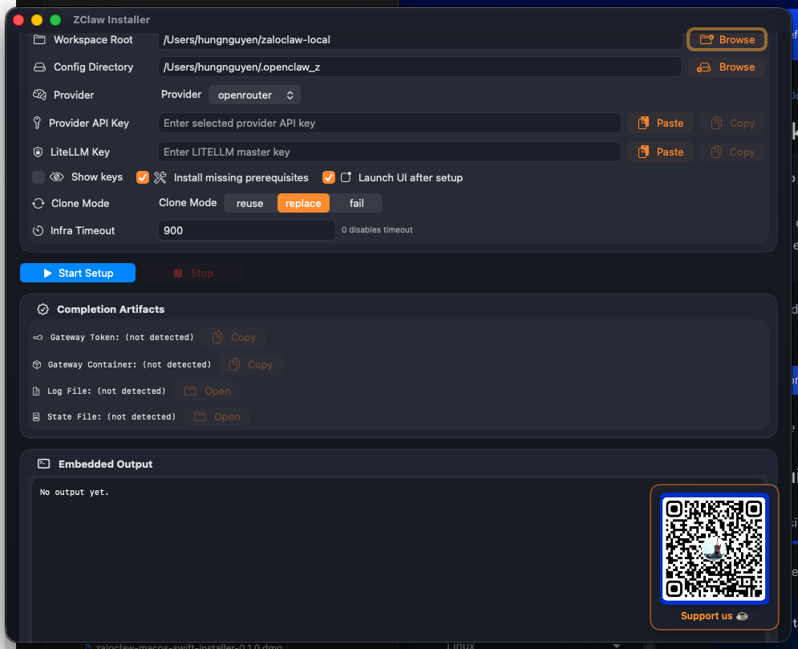
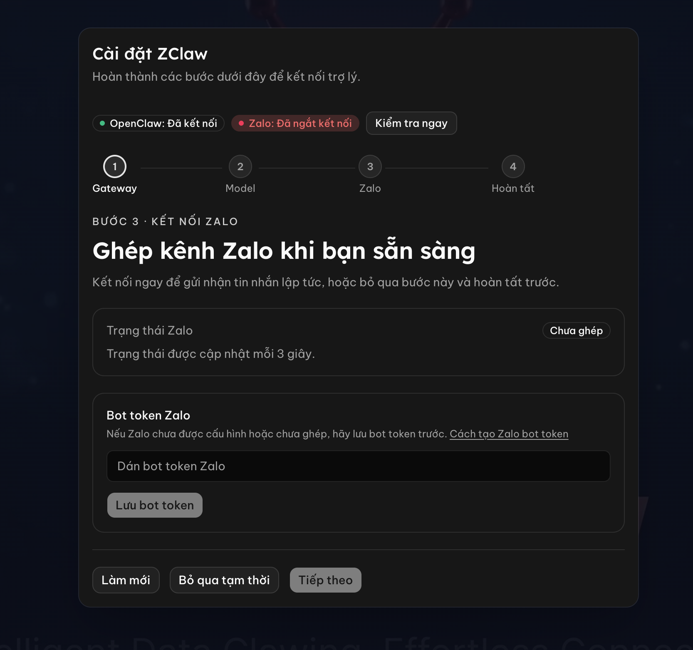
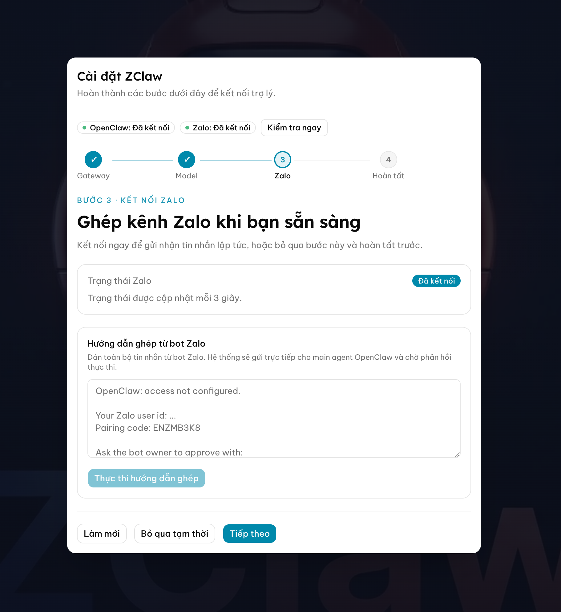
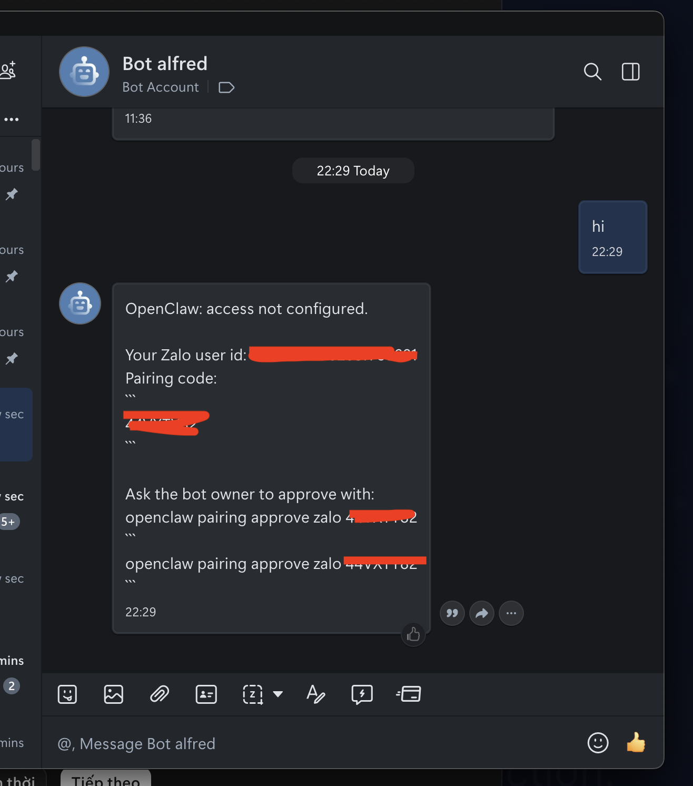
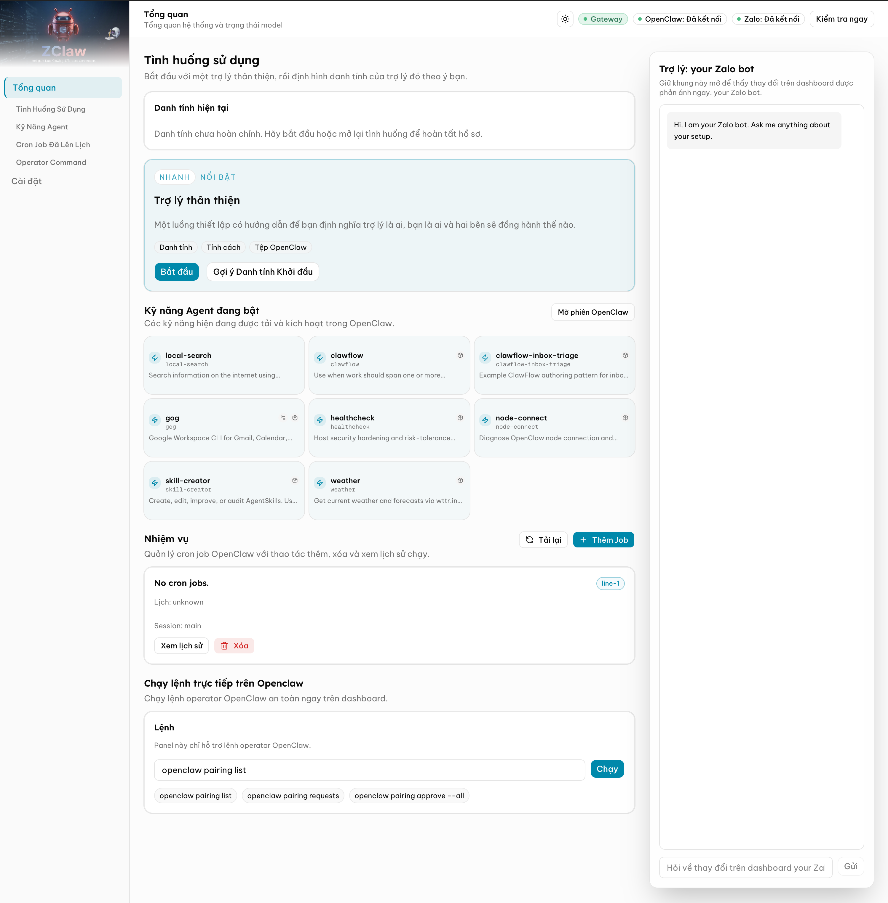

# Hướng Dẫn Cài Đặt ZaloClaw Installer (macOS)

## 1. Tải bộ cài
Tải bộ cài tại:

- https://github.com/zaloclaw/zaloclaw-setup/releases/download/v0.1.0/zaloclaw-macos-swift-installer-0.1.0.dmg

## 2. Tải và cài Docker Desktop
Tải Docker Desktop cho macOS tại:

- https://docs.docker.com/desktop/setup/install/mac-install/

## 3. Mở ZClawInstaller lần đầu trên macOS
- Nhấp chuột phải vào file `ZClawInstaller` -> chọn **Open**.
- Nếu macOS chặn ứng dụng, vào **System Settings** -> **Privacy & Security** -> chọn **Open Anyway**.

Hình minh họa:

  

## 4. Chọn AI Provider và nhập API Key
Trong màn hình cài đặt:

- Chọn AI Provider: **OpenAI**, **Google**, **Anthropic** hoặc **Openrouter**.
- Nhập API Key tương ứng với provider đã chọn.

## 5. Nhập LiteLLM Key
- Điền **LiteLLM Key** (có thể dùng password bất kỳ).
- LiteLLM là một gateway LLM trung gian giúp kết nối với đa dạng các LLM Provider, cung cấp router để tối ưu hoá chi phí

## 6. Bắt đầu cài đặt
- Nhấn **Start Setup** để bắt đầu quá trình cài đặt.
- Thời gian cài đặt thường mất khoảng **1-5 phút**.
- Có thể theo dõi tiến trình trong file log hoặc terminal.

## 7. Mở trang cấu hình sau khi cài đặt thành công
- Mở Chrome và truy cập:
  - http://localhost:3000/

Hình minh họa:

  

## 8. Nhập Bot Token của Zalo
- Nhập Bot Token của Zalo vào trang cấu hình.

Hình minh họa:

  

## 9. Ghép đôi và vào Dashboard
- Sau khi báo kết nối thành công, mở bot trên Zalo và gõ `Hi`.
- Bot sẽ hiển thị mã ghép đôi.

Hình minh họa mã ghép đôi:

  

- Ghép đôi thành công sẽ chuyển sang trang Dashboard.

Hình minh họa Dashboard:

  

